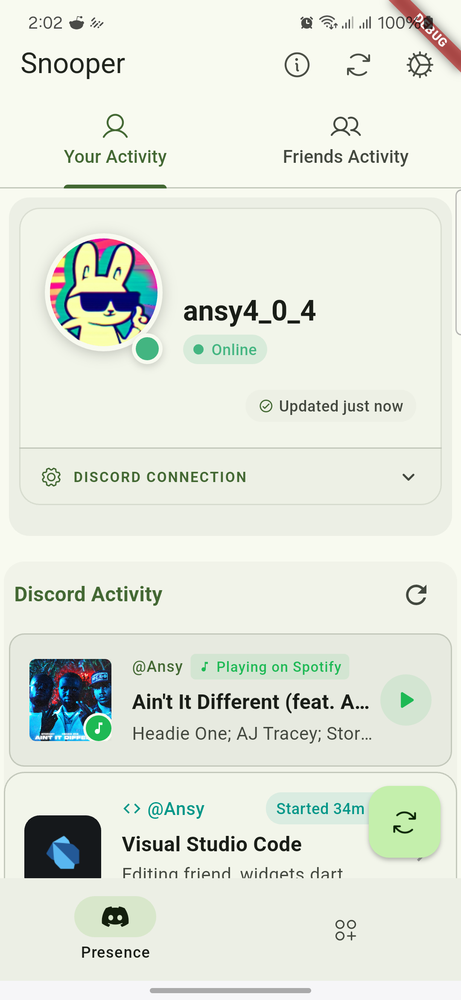
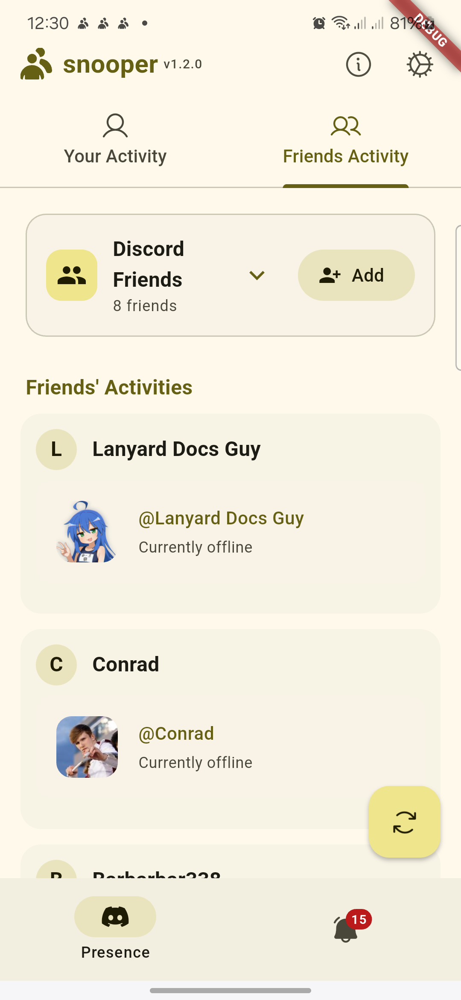
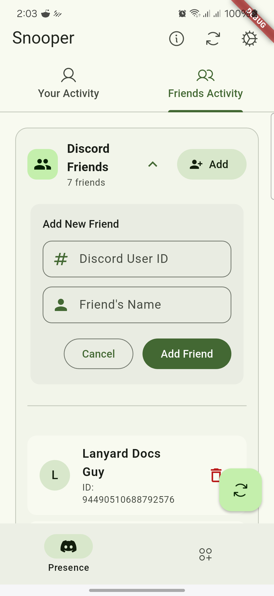
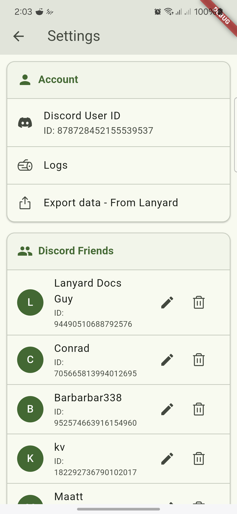
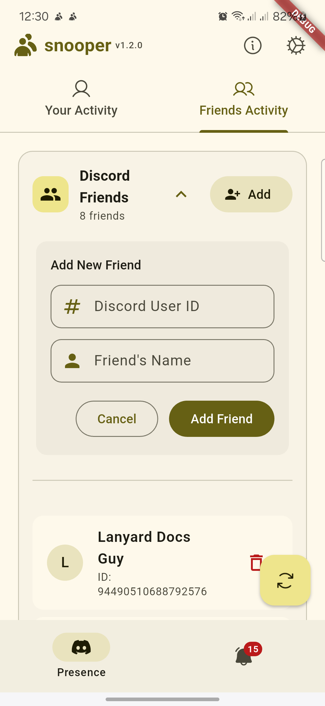
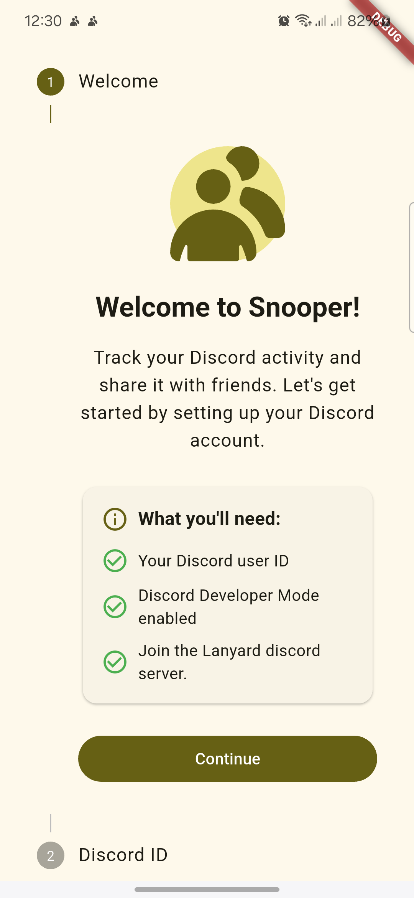

<a href="">
  <h1 align="center" >
   <!--     <br/> -->
    
  </h1>
</a>

- [English](README.md)
<!-- - [简体中文](README.zh.md)
- [Türkçe](README.tr.md) -->

# Snooper

Check your Discord activity and check on your friend's as well.


## Features

#### Get started in < 10 seconds

You must [join this Discord server](https://discord.gg/UrXF2cfJ7F) and your presence will available with your id in the app, snooper utilized the lanyard api i.e `GET api.lanyard.rest/v1/users/:your_id`. Too easy !

<!-- - **Notofications**: Get to know when your pals are online. -->

- **More tools coming soon!**

## Getting Started

This project is a starting point for a Flutter application. To run the project on your local machine, follow these steps:

### Prerequisites

- Install [Flutter](https://docs.flutter.dev/get-started/install)
- Ensure you have an emulator or a physical device connected

### Installation

1. Install dependencies:
   ```sh
   flutter pub get
   ```
2. Run the application:

   ```sh
   flutter run
   ```

### Screenshots

<div style="overflow-x: auto; white-space: nowrap;">






<!--  -->

</div>

## Resources

For additional help with Flutter development, check out these resources:

- [Flutter Docs](https://docs.flutter.dev/)
- [Write your first Flutter app](https://docs.flutter.dev/get-started/codelab)
- [Flutter Cookbook](https://docs.flutter.dev/cookbook)

## Contributing

Contributions are welcome! Feel free to submit issues, feature requests, or pull requests.

<h2 align="center">License</h2>

[GNU General Public License, version 3.0][license] © [Anslem](https://github.com/Anslem27)

[license]: /LICENSE
[github]: https://github.com/Anslem27

```
Copyright 2022 - 2025 Anslem Seguya

Licensed under the GNU General Public License, version 3.0 (the "License");
you may not use this file except in compliance with the License.
You may obtain a copy of the License at
https://www.gnu.org/licenses/

Copy code
https://www.gnu.org/licenses/gpl-3.0.en.html
Unless required by applicable law or agreed to in writing, software
distributed under the License is distributed on an "AS IS" BASIS,
WITHOUT WARRANTIES OR CONDITIONS OF ANY KIND, either express or implied.
See the License for the specific language governing permissions and
limitations under the License.
```

<!-- keytool -genkey -v -keystore %userprofile%\upload-keystore.jks -storetype JKS -keyalg RSA -keysize 2048 -validity 10000 -alias upload -->
<!--
cd C:\Users\user\Desktop
keytool -genkey -v -keystore upload-keystore.jks -storetype JKS -keyalg RSA -keysize 2048 -validity 10000 -alias upload

certutil -encode "C:\Users\ansle\Desktop\upload-keystore.jks" -

https://www.youtube.com/watch?v=mg8_pM7sGM8
 -->

<!-- flutter pub run flutter_oss_licenses:generate.dart -->
<!-- dart pub global activate fvm

fvm flutter pub get -->

---

_Check your Discord activity and check on your friend's as well.!_
