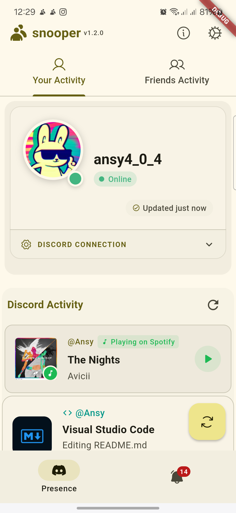
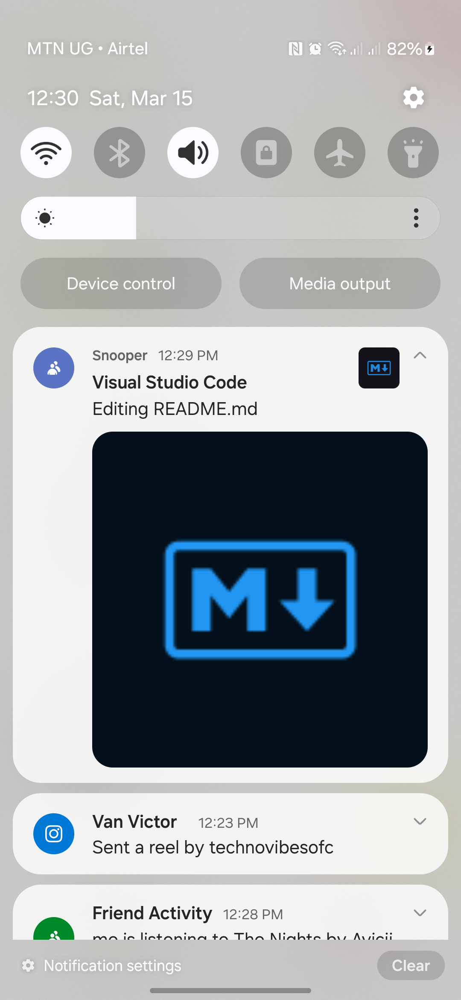
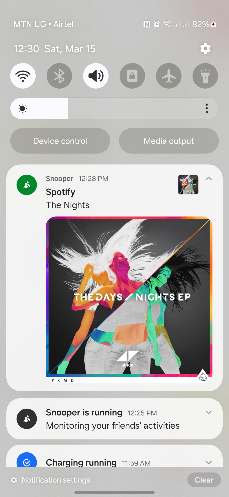
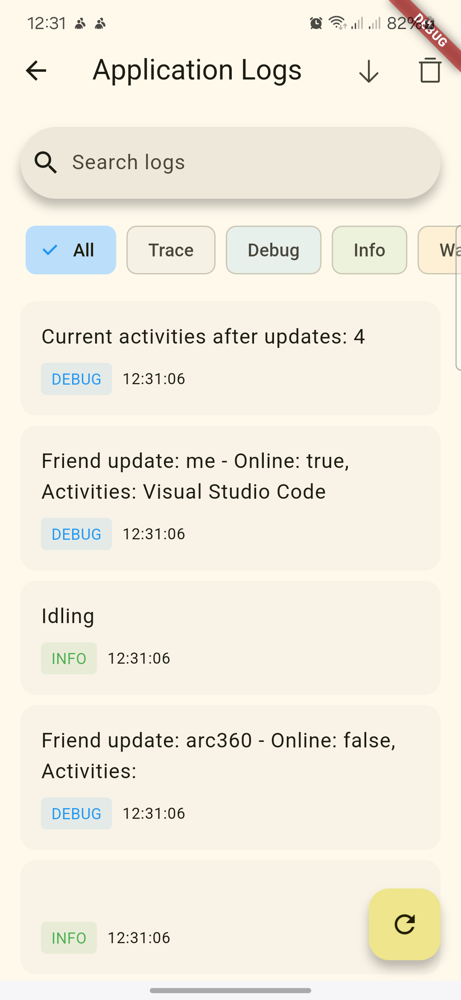
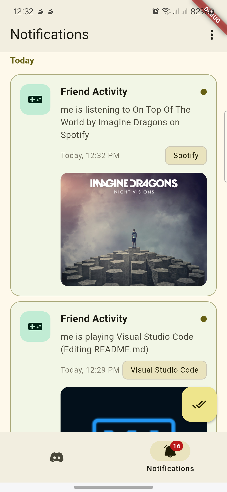

<a href="">
  <h1 align="center">
    Snooper
  </h1>
</a>

- [English](README.md)
<!-- - [简体中文](README.zh.md)
- [Türkçe](README.tr.md) -->

# Snooper

A Material You-focused Flutter app that lets you track your Discord activity and keep an eye on your friends' status. Snooper leverages the Lanyard API to provide real-time presence information with a clean, modern UI.


## Features

### Discord Presence Tracking

#### Get started in less than 10 seconds

Simply [join this Discord server](https://discord.gg/UrXF2cfJ7F) and your presence will be instantly available in the app. Snooper utilizes the Lanyard API (`GET api.lanyard.rest/v1/users/:your_id`) to fetch real-time presence data.

### Key Features

- **Real-time Status Updates**: See what your friends are playing, listening to, or doing on Discord
- **Material You Design**: Adaptive theming that matches your device's wallpaper
- **Offline Support**: View previously cached data even when offline
- **Quick Profile Sharing**: Easily share profiles with friends
- **Background Notifications**: Get notified when friends come online or start activities
- **Customizable UI**: Personalize the app with color themes and layout options

### Data Storage

Snooper uses a combination of local storage and temporary cloud storage via [THE NULL POINTER](https://0x0.st/?ref=public_apis&utm_medium=website):

```
Data Retention Policy
====================

Local data: Cached indefinitely until app data is cleared
Cloud data: Follows Lanyard API storage policies
Temporary data storage file via THE NULL POINTER (JSON file):
```

## Planned Features

- **Gamification**: Earn points and badges for tracking activities
- **Snapshot History**: Archive and view historical presence data
- **Enhanced Notifications**: More granular control over notifications
- **Localizations**: Support for multiple languages
- **UI Improvements**: More customization options and themes
- **Bug Fixes**: Continuous improvements and stability enhancements
- **Friends Grouping**: Organize friends into custom categories
- **Statistics Dashboard**: View analytics about your Discord usage patterns

### Permissions used. (some are for planned features)

```xml
<uses-permission android:name="android.permission.PACKAGE_USAGE_STATS" tools:ignore="ProtectedPermissions" />
<uses-permission android:name="android.permission.INTERNET" />
<uses-permission android:name="android.permission.ACCESS_NETWORK_STATE" />
<uses-permission android:name="android.permission.ACCESS_WIFI_STATE" />
<uses-permission android:name="android.permission.QUERY_ALL_PACKAGES" tools:ignore="QueryAllPackagesPermission" />
<uses-permission android:name="android.permission.FOREGROUND_SERVICE" />
<uses-permission android:name="android.permission.FOREGROUND_SERVICE_DATA_SYNC" />
<uses-permission android:name="android.permission.RECEIVE_BOOT_COMPLETED" />
```

## Getting Started

This project is built with Flutter. To run it on your local machine, follow these steps:

### Prerequisites

- Install [Flutter](https://docs.flutter.dev/get-started/install)
- Set up an Android emulator or connect a physical device
- Enable Developer options and USB debugging on your device

### Installation

1. Clone the repository:

   ```sh
   git clone https://github.com/Anslem27/snooper.git
   cd Snooper
   ```

2. Install dependencies:

   ```sh
   flutter pub get
   ```

3. Run the application:
   ```sh
   flutter run
   ```

### Building for Production

```sh
flutter build apk --release
```

Or for app bundles:

```sh
flutter build appbundle
```

## Screenshots

<div style="overflow-x: auto; white-space: nowrap;">












</div>

## Architecture

Snooper follows a minimalistic approach:

- **Provider** for state management (not fully implemented)
- **Background services** using Workmanager for notifications

## Troubleshooting

- **Permission Issues**: Make sure to grant all required permissions in your device settings
- **Discord Server**: You must join the Lanyard Discord server for the API to track your presence
- **Background Services**: On some devices, you may need to disable battery optimization for the app

## Resources

For Flutter development help:

- [Flutter Documentation](https://docs.flutter.dev/)
- [Flutter Cookbook](https://docs.flutter.dev/cookbook)
- [Pub.dev for packages](https://pub.dev/)
- [Material Design guidelines](https://m3.material.io/)

## Contributing

Contributions are welcome! Here's how you can help:

1. Fork the repository
2. Create a feature branch (`git checkout -b feature/amazing-feature`)
3. Commit your changes (`git commit -m 'Add some amazing feature'`)
4. Push to the branch (`git push origin feature/amazing-feature`)
5. Open a Pull Request

Please ensure your code adheres to the project's coding standards and includes appropriate tests.

<h2 align="center">License</h2>

[GNU General Public License, version 3.0][license] © [Anslem](https://github.com/Anslem27)

[license]: /LICENSE
[github]: https://github.com/Anslem27

```
Copyright 2022 - 2025 Anslem Seguya

Licensed under the GNU General Public License, version 3.0 (the "License");
you may not use this file except in compliance with the License.
You may obtain a copy of the License at

https://www.gnu.org/licenses/gpl-3.0.en.html

Unless required by applicable law or agreed to in writing, software
distributed under the License is distributed on an "AS IS" BASIS,
WITHOUT WARRANTIES OR CONDITIONS OF ANY KIND, either express or implied.
See the License for the specific language governing permissions and
limitations under the License.
```

---

_Check your Discord activity and keep an eye on your friends - all with a beautiful Material You design!_
